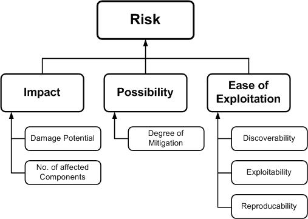

# Introduction
This tutorial will explain a structured approach or mindset for conducting threat modeling of an application, so that a thorough identification, measurement, and handling of potential security risks associated with an application can be carried out. Unlike previous models you've worked on before, threat modeling examines the system's security from the perspective of a potential attacker. Therefore, incorporating threat modeling as one of the main components of the Software Development Life Cycle (SDLC) can help enhance the security of the product being developed.

In general, threat modeling can be divided into four stages.

## Defining the Project Scope

The first step in threat modeling is understanding what is being worked on. This involves several activities such as creating Data Flow Diagrams (DFDs), identifying entry points that can be exploited by attackers, and defining assets and trust levels within the system. Reading or creating user stories can also be part of this step, which is sometimes extended to abuser stories or misuse cases to understand potential system abuse.

Data Flow Diagrams (DFDs) are often used to visualize how data flows within the system, emphasizing system-enforced access restrictions and trust levels. This process is often referred to as "analyzing application components" and is commonly performed in threat modeling, with the end result usually being a Threat Model document. However, another more integrated approach is to apply threat modeling to each user story, as suggested by Tarandach. In this context, security analysis is performed directly on each feature or change in the application. This step also includes identifying the assets to be protected, although in some cases, these assets may be outside the scope of the project or difficult to identify until a real attack occurs.

## Identifying Threats

To ensure effective threat identification, a specific methodology such as threat categorization is needed. In threat modeling, the STRIDE methodology is often used.

The purpose of this categorization is to help identify threats from the attacker’s perspective. The DFDs created in the previous step can reveal potential attack targets, such as resources, processes, data flows, and user interactions. To further organize these threats, threat trees can also be used, where each tree represents a specific threat objective. Common threat lists along with examples can also assist in the identification process. Additionally, use and abuse/misuse cases can illustrate how existing protective measures may be bypassed or where there may be security gaps in project components.

### STRIDE

The STRIDE model is a useful mnemonic for identifying threats by encouraging us to think about attacker steps such as:  
    - **S**poofing  
    - **T**ampering  
    - **R**epudiation  
    - **I**nformation Disclosure  
    - **D**enial of Service  
    - **E**levation of Privilege  

The following is a list of STRIDE threats along with their security controls:  

| Type                   | Description                                                                                                                         | Security Control |
| ---------------------- |:----------------------------------------------------------------------------------------------------------------------------------- | ---------------- |
| Spoofing               | Threat action aimed at illegally accessing and using other users' credentials, such as usernames and passwords                      | Authentication   |
| Tampering              | Threat action aimed at modifying data, either changing data stored in databases or altering data during transit through the network | Integrity        |
| Repudiation            | Threat action in the form of illegal activities in a system that lacks the ability to track actions that have been taken            | Non-Repudiation  |
| Information disclosure | Threat action in the form of unauthorized reading of files or reading data during transit                                           | Confidentiality  |
| Denial of service      | Threat action aimed at denying access to valid users, such as by making a web server temporarily unavailable                        | Availability     |
| Elevation of privilege | Threat action that aims to obtain higher access rights to access information or infiltrate systems illegally                        | Authorization    |

### Threat Ranking

Threats can be ranked from a risk factor perspective. By determining the risk factors posed by various identified threats, we can prioritize threats to support risk mitigation strategies, such as prioritizing which threats to mitigate first. Different risk factors can be used to rank threats as *High*, *Medium*, or *Low* risk. Generally, threat risk models use various factors to model risk as shown below: 

## Determining Countermeasures and Mitigation Steps

A vulnerability’s risk can be reduced or even eliminated by implementing appropriate countermeasures. One way to identify countermeasures is by using threat-countermeasure mapping lists. When determining the priority of countermeasures, the approaches used often vary, but typically consider factors such as the likelihood of an attack occurring, the potential impact of an attack, as well as the complexity or cost of remediation.

Risk mitigation strategies can also be evaluated based on their business impact. Once the potential impact is identified, there are several options for handling the risk:

- **Accept**: Decide that the impact/risk is acceptable (within tolerable limits) and document who is responsible for this decision.
- **Eliminate**: Remove the components that cause the vulnerability.
- **Mitigate**: Add protective mechanisms to reduce the impact or likelihood of the threat occurring.
- **Transfer**: Shift the risk to another party, such as an insurance company or customer.

### Threat Mitigation Techniques Based on STRIDE
Here are some mitigation techniques appropriate for each type of threat in the STRIDE model:

| Type                   | Mitigation Techniques                                                                                                                                                                                                               |
| ---------------------- | ----------------------------------------------------------------------------------------------------------------------------------------------------------------------------------------------------------------------------------- |
| Spoofing               | <ul><li>Appropriate authentication</li><li>Protection of sensitive data</li><li>Avoiding unnecessary storage of confidential information</li></ul>                                                                                  |
| Tampering              | <ul><li>Implementation of proper authorization</li><li>Use of hashes, MAC, or digital signatures to ensure data integrity</li><li>Tamper-resistant protocols</li></ul>                                                              |
| Repudiation            | <ul><li>Use of digital signatures</li><li>Timestamping</li><li>Creation of audit trails</li></ul>                                                                                                                                   |
| Information disclosure | <ul><li>Implementation of authorization controls</li><li>Use of privacy-enhancing protocols</li><li>Data encryption</li><li>Protection of sensitive data</li><li>Avoiding unnecessary storage of confidential information</li></ul> |
| Denial of service      | <ul><li>Implementation of appropriate authentication and authorization</li><li>Traffic filtering and limitation</li><li>Implementation of Quality of Service</li></ul>                                                              |
| Elevation of privilege | <ul><li>Running systems with minimal access rights (least privilege)</li></ul>                                                                                                                                                      |

After threats and appropriate security measures are identified, we can determine the threat profile based on the following criteria:
1. **Non-mitigated threats**: Threats that do not have security measures and represent vulnerabilities that can be fully exploited and cause significant impact.
2. **Partially mitigated threats**: Threats that are only reduced by one or more security measures, so they can still be partially exploited and cause limited impact.
3. **Fully mitigated threats**: Threats that have adequate security measures and no longer expose the system to vulnerabilities.

## Evaluation

The final step in threat modeling is to ensure that the entire process has been properly executed. Make sure that your threat modeling process results in documentation that includes system diagrams, a threat list, and a list of mitigation steps that have been designed.

## Threat Modeling Using Threat Dragon

Threat modeling not only requires a systematic approach but also tools that can assist in the process. **Threat Dragon** is one such tool designed to simplify threat modeling by enabling the creation of Data Flow Diagrams (DFDs), threat identification, and the formulation of mitigation steps within an integrated platform. By using Threat Dragon, development teams can more easily document, analyze, and update the threat model as the application evolves.

One important aspect of threat modeling is defining the **security requirements** that the system must meet. Threat Dragon assists in this process by providing a framework to identify and document security requirements based on the threats that have been identified. These requirements serve as guidelines for designing and implementing effective security controls.

By leveraging Threat Dragon, the security planning process can be carried out in a more structured manner, ensuring that every threat is addressed with appropriate mitigation steps before the application is further developed.